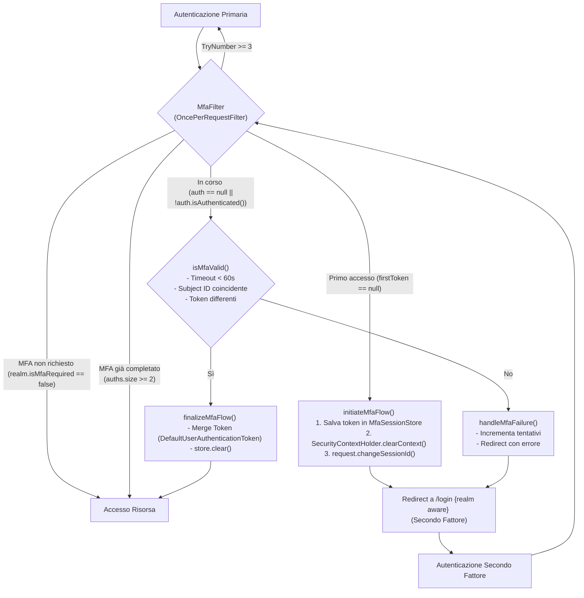

# MFA Proof of Concept (PoC) - Technical Implementation

## Flusso Logico Filter

Il sistema implementa un'autenticazione a due fattori agendo come un filtro di intercettazione post-autenticazione primaria.

## Dettagli Tecnici Implementativi

### Posizionamento nella Chain

- **Posizione**: `MfaFilter` è stato poszionato all'interno di `Filter buildSessionFilters()` in `SecurityConfig` ed è stato pozionato priama di `InternalPasswordResetOnAccessFilter` e `TosOnAccessFilter`
- **Ragione**: Deve intervenire subito dopo che l'utente è stato autenticato dal primo fattore, ma prima che acceda alle risorse protette.

### Gestione dello Stato (`MfaSessionStore`)

Lo stato del "limbo" è gestito in sessione per evitare di sporcare il database o l'oggetto utente:

- `MFA_FIRST_TOKEN`: Conserva il token della prima autenticazione.
- `MFA_TIMESTAMP`: Gestisce il timeout di sicurezza (60 secondi).
- `MFA_TRY_NUMBER`: Monitora i tentativi falliti per prevenire brute-force (`Config.MAX_MFA_ATTEMPTS`).

### Il Meccanismo di Merge

La validazione finale non si limita a un flag, ma produce una prova crittografica doppia:

- Viene creato un nuovo `DefaultUserAuthenticationToken` che combina entrambi i token (`ft` e `st`) questo token a differenza dei 2 token generati dai 2 IdP **ha 2** `DefaultUserAuthenticationToken`.
- L'identità finale dell'utente contiene quindi **due prove di autenticazione distinte** per lo stesso `Subject`.

## Garanzie di Sicurezza implementate

1. **Session Fixation**: `request.changeSessionId()` viene chiamato all'inizio del flusso MFA.
2. **Identity Spoofing**: `isMfaValid` verifica che il `subjectId` del primo e del secondo token siano identici.
3. **Context Isolation**: `SecurityContextHolder.clearContext()` assicura che l'utente non abbia alcun privilegio tra il primo e il secondo fattore.
