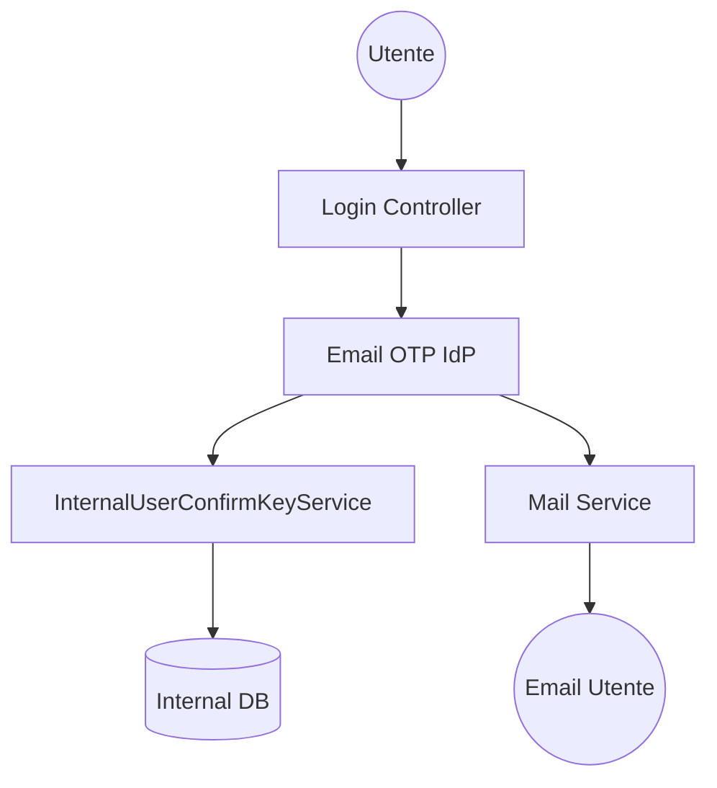

# Panoramica dell'Identity Provider Email OTP

## 1. Introduzione

L'Identity Provider (IdP) Email OTP è una funzionalità di autenticazione passwordless integrata nel framework AAC. Sfrutta l'infrastruttura dell'Internal IDP per validare l'identità tramite un One-Time Password (OTP) inviato via email.

### Obiettivo

1. Fornire un'alternativa sicura alle password basata sul possesso dell'indirizzo email.
2. Integrare l'OTP come metodo di autenticazione primaria o secondo fattore (MFA) riutilizzando i servizi di persistenza e validazione dell'Internal IDP.

## 2. Architettura High-Level

Il modulo non è più un servizio separato, ma un'estensione del provider `Internal` che delega la gestione del ciclo di vita del codice OTP all' `InternalUserConfirmKeyService`.

## 3. Strategia di Sicurezza e Validazione

L'implementazione segue i principi di sicurezza dell'Internal IDP:

- **Validazione Delegata**: Il confronto del codice avviene tramite `InternalUserConfirmKeyService`.
- **Non-Attivazione**: A differenza del flusso di registrazione, la verifica OTP per il login non imposta l'account come `confirmed`, mantenendo intatto lo stato dell'utente.
- **Hardening**:

    1. Generazione tramite `SecureRandom`.
    2. Invalidazione immediata dopo la validazione.
    3. Rate limiting integrato via configurazione di provider.

## 4. Integrazione Core

Il sistema riutilizza:

- **`InternalUserAccount`**: Modello di account di riferimento.
- **`InternalUserConfirmKeyService`**: Per la generazione e validazione della chiave di conferma (OTP).
- **`MailService`**: Per l'invio delle notifiche.
