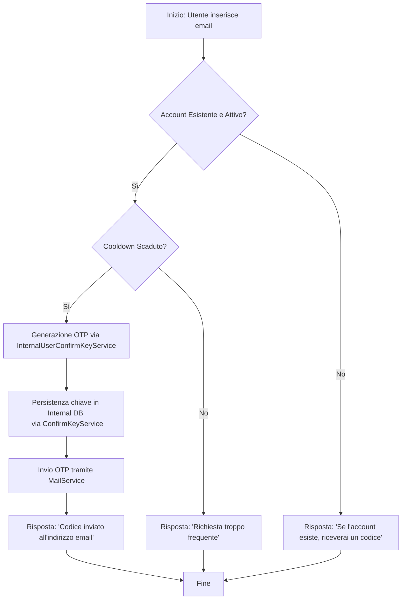
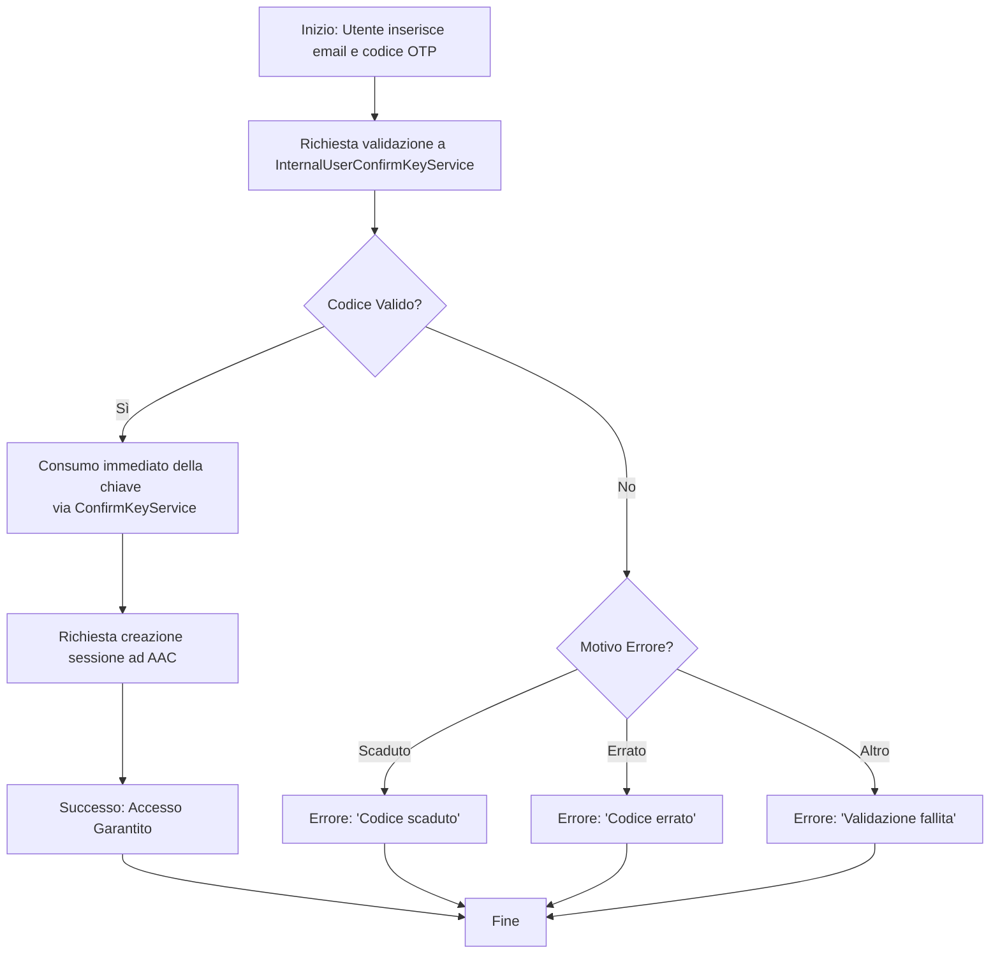

# Flussi Operativi dell'Identity Provider Email OTP

Questo documento dettaglia i processi logici e le interazioni tra i componenti per la gestione del ciclo di vita di un One-Time Password (OTP), delegando la gestione delle chiavi all'infrastruttura dell'Internal IDP.

## 1. Flusso di Richiesta OTP

Il flusso di richiesta è progettato per prevenire l'enumerazione degli utenti e proteggere il server SMTP da abusi, riutilizzando il meccanismo di "confirmation key" dell'Internal IDP.

## 2. Flusso di Validazione OTP

La validazione delega l'intera logica di verifica, scadenza e consumo al `InternalUserConfirmKeyService`, garantendo coerenza con le policy di sicurezza globali di AAC.

## 3. Tabella di Mappatura Responsabilità

| Fase | Componente Responsabile | Azione |
| :--- | :--- | :--- |
| **Identificazione** | `EmailOtpIdentityProvider` | Verifica esistenza account |
| **Generazione** | `InternalUserConfirmKeyService` | Crea chiave sicura e definisce TTL |
| **Notifica** | `MailService` | Invia l'OTP all'utente |
| **Verifica** | `InternalUserConfirmKeyService` | Confronta hash, verifica TTL e tentativi |
| **Sessione** | `AAC Core` | Genera token di autenticazione |
